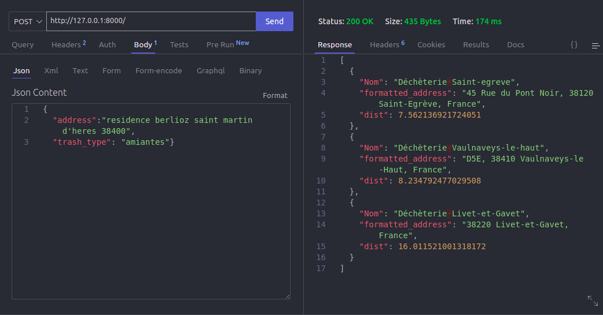

# Track my Trash

This is a repository of a webapp that I made using GoogleMaps API from GoogleCloudPlataform to deal with addresses, the app is used to find the nearests recycling sites in the Alps region of France. See the [webapp].

## analysis.ipynp
In this file you will find a notebook where I test the API and handle the raw data.

## trashlocation.py
In this file you will find the class and methods to deal with the adresses and distances.

## app.py
In this file is the flask code for the API to find the nearests recycling places.

## How to run
First, to run the webapp locally you are going to have to clone the repository:

    gh repo clone kairosilveira/track_my_trash_backend
    cd track_my_trash_backend/

Then, create and activate the virtual environment and install the dependencies(make sure eu you have python3 installed):

    python -m venv venv
    source venv/bin/activate 

Install dependencies and source environment variables

    python -m pip install --upgrade pip
    pip install -r requirements.txt
    source .env

After installation is done, you can start the flask aplication running the app.py file

    gunicorn --chdir src app:app

Now you can use the post method to consult the 3 closest recycling points to a given address using your local server, here is an example using thunder:

{
  "address":"residence berlioz saint martin d'heres 38400",
  "trash_type": "amiantes"}

[webapp]: https://track-my-trash.vercel.app/